# Build a weather-aware desk lamp with NodeMCU, Telegram and OpenWeatherMap

By Thomas Stalbrink · DfET IoT, Hogeschool van Amsterdam

This is a working prototype of the *Smartlamp*, a desk lamp concept I designed for this course. The prototype covers three of its four user interfaces: Telegram as the app (digital), the weather API (contextual) and a button (physical).


I built it in rounds Telegram first, then the weather, then the button and tested each round before starting the next one. Every step below follows that order: **what I wanted**, **what I did** and **how I tested it**. The problems I ran into are kept together in [Mistakes and solutions](#mistakes-and-solutions), so the steps stay readable.

---

## Contents

1. [What you need](#what-you-need)
2. [Before you start](#before-you-start)
3. [Step 1 – Wire the LED strip and the button](#step-1--wire-the-led-strip-and-the-button)
4. [Step 2 – Light modes and feedback via Telegram](#step-2--light-modes-and-feedback-via-telegram)
5. [Step 3 – Weerlicht: show the weather](#step-3--weerlicht-show-the-weather)
6. [Step 4 – A button that also works offline](#step-4--a-button-that-also-works-offline)
7. [Mistakes and solutions](#mistakes-and-solutions)
8. [How the code is organised](#how-the-code-is-organised)
9. [Full code](#full-code)
10. [Sources](#sources)

---

## What you need

**Hardware**

- NodeMCU 1.0 (ESP-12E) with USB cable
- LED strip with 15 WS2812 LEDs (red, yellow and black wires)
- A push button and two jumper wires

**Software and accounts**

- Arduino IDE 2.x with the esp8266 board package (3.1.2 used here)
- Libraries: **UniversalTelegramBot**, **ArduinoJson** (Benoit Blanchon), **Adafruit NeoPixel**
- Telegram on your phone, with a bot made via BotFather
- A free OpenWeatherMap account with an API key
- A Wi-Fi network on **2.4 GHz** (the NodeMCU cannot use 5 GHz)

---

## Before you start

I don't explain the basics here. If you haven't done these yet, do them first:

- **Install the Arduino IDE and the NodeMCU board** – see the course *Quickstart* manual. Board: *NodeMCU 1.0 (ESP-12E Module)*, port: your COM port (COM5 for me).
- **Make a Telegram bot** – open Telegram, search for **BotFather**, send `/newbot` and save the **bot token** you get. My bot is called *Magot*.
- **Get an OpenWeatherMap API key** – make an account on openweathermap.org and copy the key under *API keys*. A new key can take a while before it works.

Set the Serial Monitor to **115200 baud** for every step in this manual.

> **Keep your secrets secret.** Your Wi-Fi password, bot token and API key go in the code. Never put them in screenshots or on GitHub: with the bot token anyone can control your bot.

---

## Step 1 – Wire the LED strip and the button

**Goal:** connect everything before writing any code.

Unplug the USB cable first, then connect:

| From | To NodeMCU |
| --- | --- |
| LED strip Din (yellow) | D1 |
| LED strip +5V (red) | 3V |
| LED strip G (black) | G |
| Button, (blue )| D2 |
| Button (red) | G |
| Button (pruple) | 3V |


** Checkpoint:** everything is connected and the NodeMCU shows up as a COM port in *Tools → Port*.

---

## Step 2 – Light modes and feedback via Telegram

**Goal:** send `aan`, `uit`, `leeslicht` or `avond` to your bot and see the strip react. The lamp confirms with **one slow pulse** when it understood you, and **blinks twice** when it didn't.

**What I did.** I started with my Telegram bot from ToDo 4 and replaced the `disco` and `stop` commands with the modes of the Smartlamp. The feedback signals are in my design document: one pulse means *understood*, blinking twice means *not understood*.

The lamp has a small set of modes:

```cpp
enum Stand { UIT, LEESLICHT, AVOND, WEERLICHT };
```

Each mode has its own colour:

| Command | Mode | Colour (R, G, B) |
| --- | --- | --- |
| `leeslicht` | Reading light | 255, 255, 230 (bright, cool white) |
| `avond` | Evening | 255, 110, 20 (soft, warm) |
| `aan` / `uit` | On / off | back to the last mode / off |

The feedback is what makes it feel like one system: the same signal means the same thing everywhere. My first version of the pulse was a single white flash, but it was too fast to notice (see [Mistakes](#1-the-pulse-was-too-fast-to-notice)). Now the pulse fades to white and back in about 0.6 seconds. For that I split the code into three small functions: `standKleur()` gives the colour of the current mode, `mengNaarWit()` mixes that colour with a percentage of white, and `puls()` creates the fade:

```cpp
void puls() {
  for (int p = 0; p <= 100; p += 5) { mengNaarWit(p); delay(15); }
  for (int p = 100; p >= 0; p -= 5) { mengNaarWit(p); delay(15); }
  toonStand();
}
```

The bot compares the text in lower case, because Telegram is ona phone and they automatically start a message with a capital letter ("Avond" instead of "avond"):

```cpp
text.toLowerCase();
text.trim();
```

**How I tested it.** I sent every command from Telegram one by one, and watched the strip and the Serial Monitor at the same time. The Serial Monitor prints every incoming message (`Bericht: …`), so I could see whether a problem was in Telegram or in my code.

**checkpoint 2a – modes:** `leeslicht`, `uit` and `aan` give a pulse and the right colour; `aan` returns to the last mode.

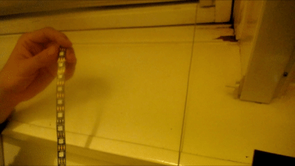

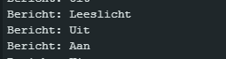

**checkpoint 2b – evening:** `avond` turns the strip warm, the bot answers "Avond aan".

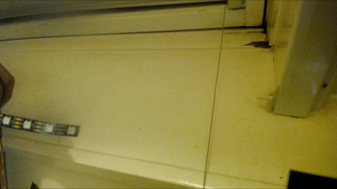

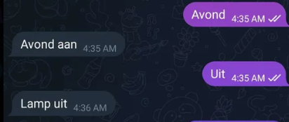

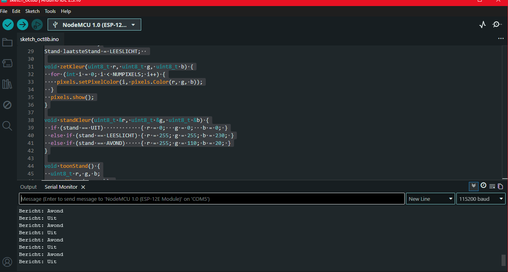

**checkpoint 2c – not understood:** any other text makes the strip blink twice and the bot replies with the list of commands.

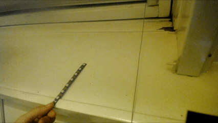

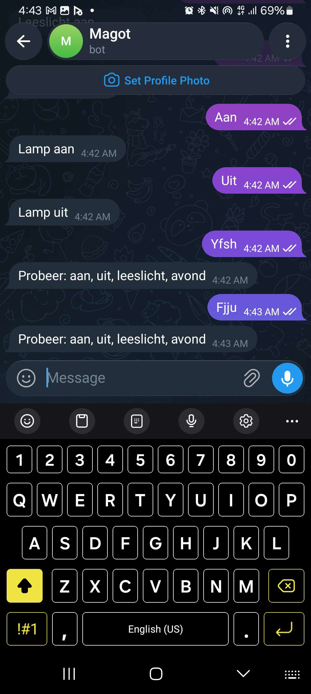

---

## Step 3 – Weerlicht: show the weather

**Goal:** send `weerlicht` and the lamp takes the colour of the weather forecast. While Weerlicht is on, itchecks the weather again every 10 minutes.

**What I did.** I took the weather request from my weather station (ToDo 2) and moved it into the Telegram sketch. Instead of showing the temperature with the number of LEDs, the whole strip now takes the colour of the weather. When the weather can't be fetched, the lamp gives the same "not understood" feedback as in step 2: it blinks twice and the bot answers "Kon het weer niet ophalen".

Moving the code over wasn't just copy and paste. Two things are new in this step:

- **Two kinds of connections in one sketch.** Telegram needs a secure connection (`WiFiClientSecure`), the weather API uses a normal one (`WiFiClient`).
- **`HTTP/1.0` instead of `HTTP/1.1`.** With HTTP/1.0 the server sends its answer in one piece, so ArduinoJson can read it straight from the connection.

```cpp
client.print(String("GET /data/2.5/forecast?q=") + CITY + "&appid=" + OWM_KEY +
             "&units=metric&cnt=1 HTTP/1.0\r\n" +
             "Host: api.openweathermap.org\r\n" +
             "Connection: close\r\n\r\n");
```

The weather type decides the colour:

| Weather | Colour |
| --- | --- |
| Rain | Blue |
| Drizzle | Light blue |
| Thunderstorm | Purple |
| Snow | White |
| Clear | Orange|
| Clouds | grey |
| Hail | Turquoise |
| Anything else (mist, fog) | Green |

**How I tested it.** First with the real weather of that moment, then by forcing other weather types, because you can't wait for a thunderstorm.

**checkpoint 3a – real weather:** `weerlicht` gives a pulse, the strip turns the weather colour and the bot answers with the weather, for example "Weerlicht aan: regen". The Serial Monitor shows a line like `Weer: RAIN (light rain)`.

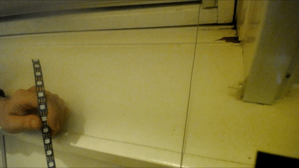

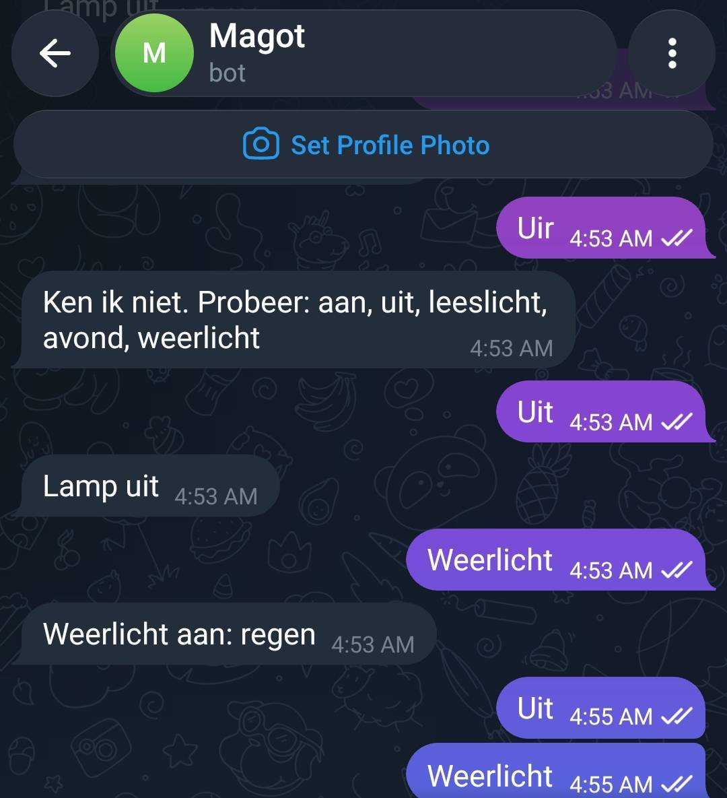

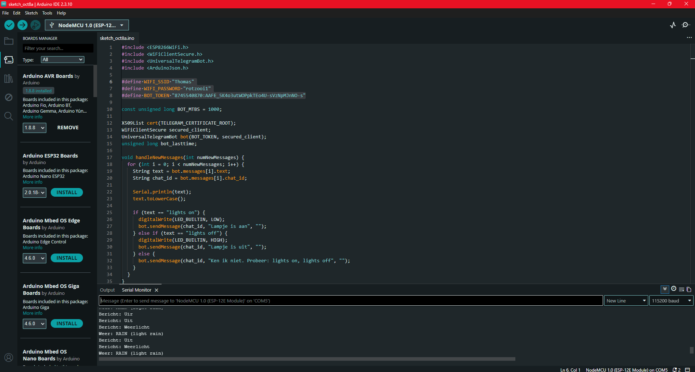

**checkpoint 3b – test other weather.** You don't want to wait for a thunderstorm. Add this line just before `weer.toUpperCase();` in `haalWeer()`, upload and send `weerlicht`:

```cpp
weer = "THUNDERSTORM";
```

The strip turns purple and the bot says "Weerlicht aan: onweer". The Serial Monitor still shows the real description behind it ("light rain"), because you only overwrite the weather type. **Remove the line when you're done testng.**

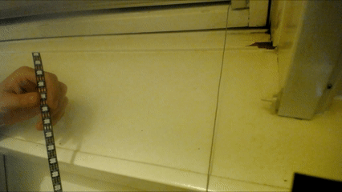

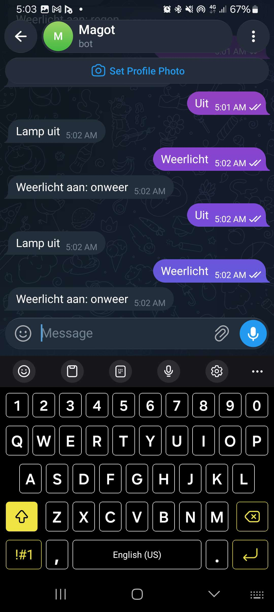

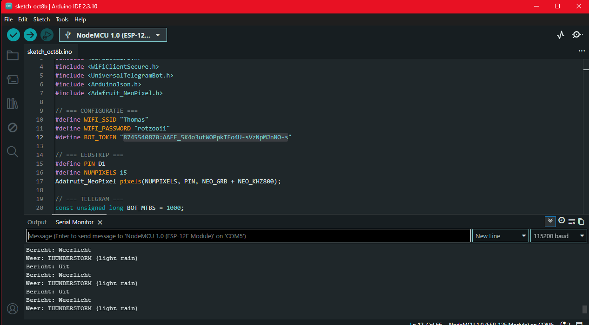

---

## Step 4 – A button that also works offline

**Goal:** press the button once to switch the lamp on or off, twice to switch Weerlicht on or off. The button keeps working when the Wi-Fi is gone.

**What I did.** The button had the most back and forth of the whole prototype:

1. I first built it with a single and a double press, as in my design document (1× = on/off, 2× = Weerlicht).
2. Then I decided two presses weren't needed and made a version with only a single press.
3. In the end I put the double press back, because the prototype should test the design, and the design says 2× is Weerlicht and it was not very hard to implement.


**Single and double press.** After a press, the lamp waits 0.4 seconds (`DUBBEL_TIJD`) to see if a second press follows. That's why it reacts a little later than you'd expect.

**Interrupt instead of reading the pin in `loop()`.** `bot.getUpdates()` sometimes blocks for about a second. If you only read the button in `loop()`, you miss presses during that time. With an interrupt, the NodeMCU counts every press, even while it's busy:

```cpp
void IRAM_ATTR knopISR() {
  unsigned long nu = millis();
  if (nu - laatsteKlik > 100) {
    klikken++;
    laatsteKlik = nu;
  }
}
```

The `100` is the snapback time: a button's contact bounces for a moment sometimes, and presses within 0.1 seconds count as one.

**Working without internet.** In my design, the lamp keeps working offline and syncs what you did later. In my earlier sketches, `setup()` waited forever for Wi-Fi, so without Wi-Fi nothing worked at all. Now it gives up after 15 seconds and the lamp just works offline. Offline actions are saved with the time, set to Dutch time (`CET-1CEST,M3.5.0,M10.5.0/3`), so the message afterwards tells you *when* you did something. When the lamp is offline:

- the last LED turns **orange** (the status light),
- the button still works,
- the lamp remembers what you did, and sends it to Telegram as soon as the Wi-Fi is back ("Terwijl ik offline was: …").

**How I tested it.** I tested the button first with the Serial Monitor open, to see how each press was counted. Then I tested offline by turning off my hotspot while the lamp was on. That's where the orange status light turned out not to show up 
**checkpoint 4a – button:** one press switches the lamp on or off; the Serial Monitor shows `Knop: aan` or `Knop: uit`. Two presses switch Weerlicht on.

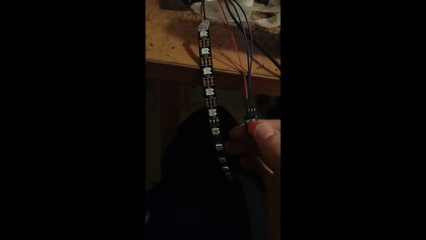

**checkpoint 4b – offline:** send one message to the bot first (so it knows your chat). Turn off your Wi-Fi or hotspot. After a few seconds the last LED turns orange and the Serial Monitor shows `WiFi weg`. Press the button: the lamp still switches. Turn the Wi-Fi back on: the orange LED disappears and the bot sends what happened while offline.

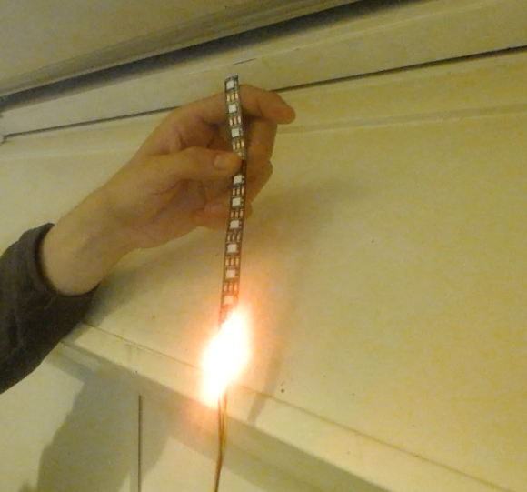
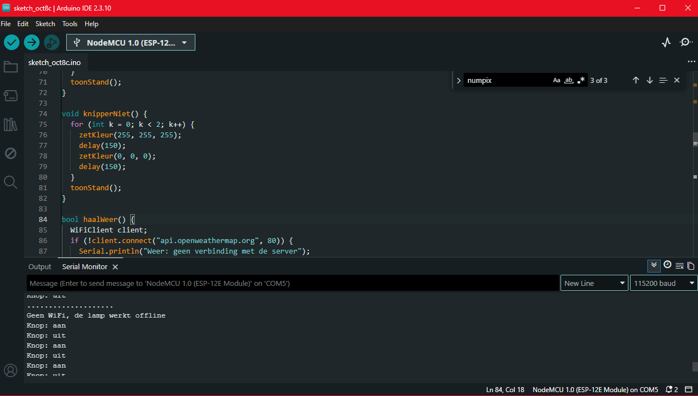

---

## Mistakes and solutions

These are the problems I ran into while building, what I tried and what worked.

### 1. The pulse was too fast to notice

**What happened:** my first "understood" signal was a single white flash of 100 ms. When I tested it, it was way too short.

**Solution:** I replaced the flash with a fade to white and back (`mengNaarWit()`), about 0.6 s in total. Much longer.

### 2. Single press only, or a double press too?

**What I tried:** a version with a double press, then a version without (I decided two presses weren't needed), and then back to the version with.

**Solution:** keeping the double press, because it's part of my design. Side effect: the lamp reacts 0.4 s after a single press and the code was slightly more complex for it.

### 3. A double press sometimes gave a double pulse

**What happened:** pressing twice sometimes gave two pulses instead of switching Weerlicht.

**Possible causes Ichecked:**

1. The two presses were counted as two single presses, because the double-press time was too short. In the Serial Monitor you then see two lines (`Knop: aan`, `Knop: uit`).
2. Fetching the weather failed, so the "not understood" blink looked like a second pulse.
3. The button bounced when I released it, because I had lowered the snapback time to 100 ms.

**Result:** after testing again, it worked after putting my credentials in cause i had switched my hotspot password between testing because of friends.


### 5. A forced thunderstorm still said "light rain"

**What happened:** after forcing `weer = "THUNDERSTORM";`, the strip turned purple, but the Serial Monitor still showed the real description.

**Cause:** I only overwrote the weather type, not the description.

**Solution:** none needed – this is expected. Just remove the test line afterwards.

**Other things to watch out for:**

| Problem | Cause | Solution |
| --- | --- | --- |
| The bot doesn't react to "Avond" | Telegram starts messages with a capital letter | `text.toLowerCase()` before comparing |
| Endless dots, no "WiFi verbonden" | 5 GHz network or wrong password | Use 2.4 GHz (on iPhone: hotspot → *Maximise compatibility*) |
| Strange characters in the Serial Monitor | Wrong baud rate | 115200 baud |
| "Kon het weer niet ophalen" | API key missing or not active yet | Check `OWM_KEY`; new keys can take a while |
| Wrong colours (red shows as green) | Wrong colour order for your strip | Try `NEO_RGB` instead of `NEO_GRB` |
| Code doesn't start after adding the button | Button on D3, D4 or D8 | Use D2 |
| The bot reacts slowly while blinking | `delay()` in the pulse blocks the bot | Keep pulses short (under 1 s) |

---

## How the code is organised

**Goal:** find your way in the full code quickly – which function does what, how data moves through the sketch, and which values you can safely change.

### How data moves through the sketch

Every input ends up in the same place: it changes `stand`, and the strip is redrawn through `standKleur()` → `zetKleur()` → `pixels.show()`. That's why all three interfaces give the same feedback.

```
Telegram   bot.getUpdates() → handleNewMessages() → stand → puls() / knipperNiet() → zetKleur()
Weather    OpenWeatherMap JSON → haalWeer() → weerR/G/B + weerNaam → standKleur() → zetKleur()
Button     knopISR() → klikken → verwerkKnop() → knopEnkel() / knopDubbel() → stand → puls()
Offline    noteerOffline() → offlineLog → checkVerbinding() → bot.sendMessage("Terwijl ik offline was: …")
```

Something wrong on the strip? Follow the line back. If the Serial Monitor shows the right message or weather but the strip doesn't change, the problem is after `stand` (colour or `zetKleur()`); if the message doesn't show up at all, it's before.

### Values you can change

| Value | Where | Default | Unit | Range | What happens if you change it |
| --- | --- | --- | --- | --- | --- |
| `NUMPIXELS` | top | 15 | LEDs | number of LEDs on your strip | LEDs are numbered 0 to `NUMPIXELS - 1`, so the last LED is 14 |
| `setBrightness()` | `setup()` | 80 | – | 0–255 | Higher is brighter for all colours, including the orange status light |
| Colours | `standKleur()`, `haalWeer()` | see steps 2 and 3 | R, G, B | 0–255 each | Values above 255 don't fit in a `uint8_t` and wrap around |
| `BOT_MTBS` | top | 1000 | ms | about 1000 or more | How often the bot checks Telegram; lower means more requests |
| `WEER_INTERVAL` | top | 600 000 (10 min) | ms | 10 min or more | The forecast comes in 3 hour blocks, so checking more often adds nothing |
| `DUBBEL_TIJD` | top | 400 | ms | about 250–600 | Lower: a double press can count as two single presses. Higher: the lamp reacts later |
| snapback | `knopISR()` | 100 | ms | about 50–200 | Lower: one press can count twice. Higher: fast double presses can be missed |
| `SYNC_INTERVAL` | top | 10 000 | ms | – | How long the lamp waits between attempts to send the offline log |
| Wi-Fi timeout | `setup()` | 15 000 | ms | – | How long the lamp waits for Wi-Fi at start-up before working offline |
| Pulse | `puls()` | steps of 5 %, `delay(15)` | % and ms | – | 2 × 21 steps × 15 ms ≈ 0.6 s. Every extra millisecond blocks the bot for longer |

---

## Full code

Fill in your own Wi-Fi name, password, bot token and OpenWeatherMap key.

```cpp
#include <ESP8266WiFi.h>
#include <WiFiClientSecure.h>
#include <WiFiClient.h>
#include <UniversalTelegramBot.h>
#include <ArduinoJson.h>
#include <Adafruit_NeoPixel.h>

#define WIFI_SSID "YOUR_WIFI_NAME"
#define WIFI_PASSWORD "YOUR_WIFI_PASSWORD"
#define BOT_TOKEN "YOUR_BOT_TOKEN"
#define OWM_KEY "YOUR_API_KEY"
#define CITY "Amsterdam,NL"

#define PIN D1
#define NUMPIXELS 15
#define KNOP D2
Adafruit_NeoPixel pixels(NUMPIXELS, PIN, NEO_GRB + NEO_KHZ800);

const unsigned long BOT_MTBS = 1000;
const unsigned long WEER_INTERVAL = 600000;
const unsigned long DUBBEL_TIJD = 400;
const unsigned long SYNC_INTERVAL = 10000;

X509List cert(TELEGRAM_CERTIFICATE_ROOT);
WiFiClientSecure secured_client;
UniversalTelegramBot bot(BOT_TOKEN, secured_client);
unsigned long bot_lasttime = 0;
unsigned long weer_lasttime = 0;
unsigned long sync_lasttime = 0;

enum Stand { UIT, LEESLICHT, AVOND, WEERLICHT };
Stand stand = UIT;
Stand laatsteStand = LEESLICHT;

uint8_t weerR = 0, weerG = 0, weerB = 0;
String weerNaam = "onbekend";

String laatsteChatId = "";
String offlineLog = "";
bool wasOnline = false;

volatile int klikken = 0;
volatile unsigned long laatsteKlik = 0;

void IRAM_ATTR knopISR() {
  unsigned long nu = millis();
  if (nu - laatsteKlik > 100) {
    klikken++;
    laatsteKlik = nu;
  }
}

bool online() {
  return WiFi.status() == WL_CONNECTED;
}

String tijdNu() {
  time_t now = time(nullptr);
  if (now < 24 * 3600) return "??:??";
  struct tm *t = localtime(&now);
  char buf[6];
  snprintf(buf, sizeof(buf), "%02d:%02d", t->tm_hour, t->tm_min);
  return String(buf);
}

void zetKleur(uint8_t r, uint8_t g, uint8_t b) {
  for (int i = 0; i < NUMPIXELS; i++) {
    pixels.setPixelColor(i, pixels.Color(r, g, b));
  }
  if (!online()) {
    pixels.setPixelColor(NUMPIXELS - 1, pixels.Color(255, 80, 0));
  }
  pixels.show();
}

void standKleur(uint8_t &r, uint8_t &g, uint8_t &b) {
  if (stand == UIT)            { r = 0;     g = 0;     b = 0; }
  else if (stand == LEESLICHT) { r = 255;   g = 255;   b = 230; }
  else if (stand == AVOND)     { r = 255;   g = 110;   b = 20; }
  else if (stand == WEERLICHT) { r = weerR; g = weerG; b = weerB; }
}

void toonStand() {
  uint8_t r, g, b;
  standKleur(r, g, b);
  zetKleur(r, g, b);
}

void mengNaarWit(int procent) {
  uint8_t r, g, b;
  standKleur(r, g, b);
  zetKleur(r + (255 - r) * procent / 100,
           g + (255 - g) * procent / 100,
           b + (255 - b) * procent / 100);
}

void puls() {
  for (int p = 0; p <= 100; p += 5) {
    mengNaarWit(p);
    delay(15);
  }
  for (int p = 100; p >= 0; p -= 5) {
    mengNaarWit(p);
    delay(15);
  }
  toonStand();
}

void knipperNiet() {
  for (int k = 0; k < 2; k++) {
    zetKleur(255, 255, 255);
    delay(150);
    zetKleur(0, 0, 0);
    delay(150);
  }
  toonStand();
}

bool haalWeer() {
  WiFiClient client;
  if (!client.connect("api.openweathermap.org", 80)) {
    Serial.println("Weer: geen verbinding met de server");
    return false;
  }
  client.print(String("GET /data/2.5/forecast?q=") + CITY + "&appid=" + OWM_KEY +
               "&units=metric&cnt=1 HTTP/1.0\r\n" +
               "Host: api.openweathermap.org\r\n" +
               "Connection: close\r\n\r\n");

  if (!client.find("\r\n\r\n")) {
    Serial.println("Weer: geen antwoord");
    return false;
  }

  DynamicJsonDocument doc(4096);
  DeserializationError err = deserializeJson(doc, client);
  if (err) {
    Serial.println(String("Weer: JSON-fout ") + err.c_str());
    return false;
  }

  String weer = doc["list"][0]["weather"][0]["main"].as<String>();
  String beschrijving = doc["list"][0]["weather"][0]["description"].as<String>();
  weer.toUpperCase();
  beschrijving.toLowerCase();
  Serial.println("Weer: " + weer + " (" + beschrijving + ")");

  if (beschrijving.indexOf("hail") != -1) { weerR = 0;   weerG = 255; weerB = 255; weerNaam = "hagel"; }
  else if (weer == "THUNDERSTORM")         { weerR = 150; weerG = 0;   weerB = 255; weerNaam = "onweer"; }
  else if (weer == "RAIN")                 { weerR = 40;  weerG = 100; weerB = 255; weerNaam = "regen"; }
  else if (weer == "DRIZZLE")              { weerR = 0;   weerG = 160; weerB = 255; weerNaam = "motregen"; }
  else if (weer == "SNOW")                 { weerR = 255; weerG = 255; weerB = 255; weerNaam = "sneeuw"; }
  else if (weer == "CLEAR")                { weerR = 255; weerG = 160; weerB = 0;   weerNaam = "zonnig"; }
  else if (weer == "CLOUDS")               { weerR = 170; weerG = 170; weerB = 160; weerNaam = "bewolkt"; }
  else                                     { weerR = 0;   weerG = 200; weerB = 120; weerNaam = beschrijving; }
  return true;
}

void noteerOffline(String actie) {
  if (!online()) {
    offlineLog += tijdNu() + " " + actie + "\n";
  }
}

void lampAan() {
  stand = laatsteStand;
  puls();
}

void lampUit() {
  if (stand != UIT) laatsteStand = stand;
  stand = UIT;
  puls();
}

bool weerlichtAan() {
  bool ok = online() ? haalWeer() : (weerNaam != "onbekend");
  if (ok) {
    stand = WEERLICHT;
    laatsteStand = stand;
    weer_lasttime = millis();
    puls();
  } else {
    knipperNiet();
  }
  return ok;
}

void knopEnkel() {
  if (stand == UIT) {
    lampAan();
    noteerOffline("aan met knop");
    Serial.println("Knop: aan");
  } else {
    lampUit();
    noteerOffline("uit met knop");
    Serial.println("Knop: uit");
  }
}

void knopDubbel() {
  if (stand == WEERLICHT) {
    stand = LEESLICHT;
    laatsteStand = stand;
    puls();
    noteerOffline("Weerlicht uit met knop");
    Serial.println("Knop: Weerlicht uit");
  } else if (weerlichtAan()) {
    noteerOffline("Weerlicht aan met knop");
    Serial.println("Knop: Weerlicht aan");
  }
}

void verwerkKnop() {
  noInterrupts();
  int k = klikken;
  unsigned long t = laatsteKlik;
  interrupts();

  if (k > 0 && millis() - t > DUBBEL_TIJD) {
    noInterrupts();
    klikken = 0;
    interrupts();
    if (k == 1) knopEnkel();
    else knopDubbel();
  }
}

void checkVerbinding() {
  bool nuOnline = online();
  if (nuOnline != wasOnline) {
    wasOnline = nuOnline;
    Serial.println(nuOnline ? "WiFi terug" : "WiFi weg");
    toonStand();
  }

  if (nuOnline && offlineLog.length() > 0 && laatsteChatId != "" &&
      millis() - sync_lasttime > SYNC_INTERVAL) {
    sync_lasttime = millis();
    if (bot.sendMessage(laatsteChatId, "Terwijl ik offline was:\n" + offlineLog, "")) {
      Serial.println("Offline acties gesynct");
      offlineLog = "";
    }
  }
}

void handleNewMessages(int numNewMessages) {
  for (int i = 0; i < numNewMessages; i++) {
    String text = bot.messages[i].text;
    String chat_id = bot.messages[i].chat_id;
    laatsteChatId = chat_id;

    Serial.println("Bericht: " + text);
    text.toLowerCase();
    text.trim();

    if (text == "aan") {
      lampAan();
      bot.sendMessage(chat_id, "Lamp aan", "");
    } else if (text == "uit") {
      lampUit();
      bot.sendMessage(chat_id, "Lamp uit", "");
    } else if (text == "leeslicht") {
      stand = LEESLICHT;
      laatsteStand = stand;
      puls();
      bot.sendMessage(chat_id, "Leeslicht aan", "");
    } else if (text == "avond") {
      stand = AVOND;
      laatsteStand = stand;
      puls();
      bot.sendMessage(chat_id, "Avond aan", "");
    } else if (text == "weerlicht") {
      if (weerlichtAan()) {
        bot.sendMessage(chat_id, "Weerlicht aan: " + weerNaam, "");
      } else {
        bot.sendMessage(chat_id, "Kon het weer niet ophalen", "");
      }
    } else {
      knipperNiet();
      bot.sendMessage(chat_id, "Ken ik niet. Probeer: aan, uit, leeslicht, avond, weerlicht", "");
    }
  }
}

void setup() {
  Serial.begin(115200);
  Serial.println();

  pinMode(KNOP, INPUT_PULLUP);
  attachInterrupt(digitalPinToInterrupt(KNOP), knopISR, FALLING);

  pixels.begin();
  pixels.setBrightness(80);

  configTime("CET-1CEST,M3.5.0,M10.5.0/3", "pool.ntp.org");
  secured_client.setTrustAnchors(&cert);

  Serial.print("Verbinden met WiFi ");
  Serial.print(WIFI_SSID);
  WiFi.mode(WIFI_STA);
  WiFi.begin(WIFI_SSID, WIFI_PASSWORD);
  unsigned long start = millis();
  while (!online() && millis() - start < 15000) {
    Serial.print(".");
    delay(500);
  }

  if (online()) {
    Serial.print("\nWiFi verbonden. IP-adres: ");
    Serial.println(WiFi.localIP());
    start = millis();
    while (time(nullptr) < 24 * 3600 && millis() - start < 5000) {
      delay(100);
    }
  } else {
    Serial.println("\nGeen WiFi, de lamp werkt offline");
  }

  wasOnline = online();
  toonStand();
}

void loop() {
  if (online() && millis() - bot_lasttime > BOT_MTBS) {
    int numNewMessages = bot.getUpdates(bot.last_message_received + 1);
    while (numNewMessages) {
      handleNewMessages(numNewMessages);
      numNewMessages = bot.getUpdates(bot.last_message_received + 1);
    }
    bot_lasttime = millis();
  }

  if (stand == WEERLICHT && online() && millis() - weer_lasttime > WEER_INTERVAL) {
    if (haalWeer()) toonStand();
    weer_lasttime = millis();
  }

  verwerkKnop();
  checkVerbinding();
}
```

---

## Sources

- UniversalTelegramBot library – *EchoBot* example for ESP8266 (basis for the Telegram part).
- De Vries, D. – *nodemcu-weather.ino* (GitHub gist), basis for the weather request.
- OpenWeatherMap – *5 day / 3 hour forecast API*, openweathermap.org.
- Adafruit – *NeoPixel* library and *simple* example.
- HvA DfET IoT – *Quickstart*, *Ubicomp Opdracht 1 – De LEDstrip* and *Telegram Adafruit ESP8266* assignments. todo 4
